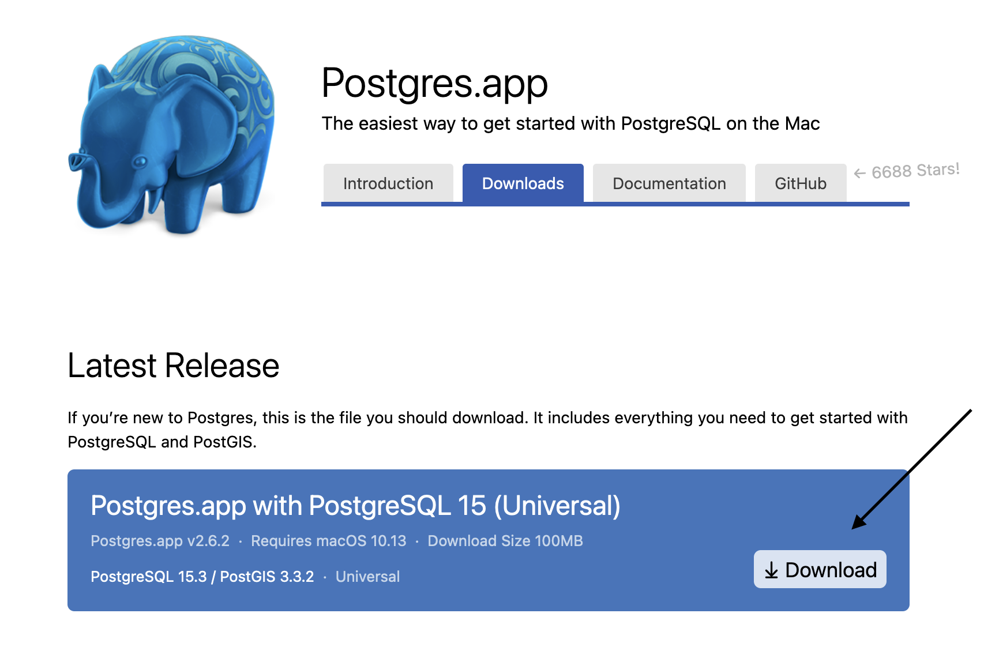

<a id="readme-top"></a>

# 📗 Table of Contents

- [📖 About the Project](#about-project)
  - [🛠 Built With](#built-with)
    - [Tech Stack](#tech-stack)
    - [Key Features](#key-features)
- [💻 Getting Started](#getting-started)
  - [Setup](#setup)
  - [Prerequisites](#prerequisites)
  - [Install](#install)
  - [Usage](#usage)
  - [Run tests](#run-tests)
  - [Deployment](#triangular_flag_on_post-deployment)
- [👥 Authors](#authors)
- [🔭 Future Features](#future-features)
- [🤝 Contributing](#contributing)
- [⭐️ Show your support](#support)
- [🙏 Acknowledgements](#acknowledgements)
- [❓ FAQ](#faq)
- [📝 License](#license)

# 📖 About The Project <a id="about-project"></a>

**Vet Clinic DB** is a database that creates a table named **animals** and inserts 4 animals with their descriptions including name, date_of_birth, weight_kg, neutered, escape_attempts and then makes different queries on those animals. It is meant for SQL learning purpose.

## 🛠 Built With <a id="built-with"></a>

### Tech Stack <a id="tech-stack"></a>

<details>
  <summary>Client</summary>
  <ul>
    <li><a href="https://www.postgresql.org/docs/current/app-psql.html">psql</a></li>
  </ul>
</details>

<details>
<summary>Database</summary>
  <ul>
    <li><a href="https://www.postgresql.org/">PostgreSQL</a></li>
  </ul>
</details>

<p align="right">(<a href="#readme-top">back to top</a>)</p>

### Key Features <a id="key-features"></a>

- **Transactions are Atomic**
- **It is Consistent**
- **It's Reliable/Durable**
- **It is PostgreSQL**

<p align="right">(<a href="#readme-top">back to top</a>)</p>

## 💻 Getting Started <a id="getting-started"></a>

How to install PostgreSQL on MacOS you ask?
Well, let's start by install this simple app: [PostgreSQL.app](https://postgresapp.com/downloads.html)



Then follow the instructions (1-2-3) in [here](https://postgresapp.com/)

And then if you have an open terminal close and open a new one.
Enter the command below:

```sh
 $ psql
```

Use all the default fields by pressing enter and you'll be logged in.

<br />

<p align="right">(<a href="#readme-top">back to top</a>)</p>

### Setup

Clone this repository to your desired folder:

Example commands:

```sh
  cd my-folder
  git clone https://github.com/dev89s/vet-clinic-db.git
```

## 👥 Authors <a id="authors"></a>

👤 **Author1**

- GitHub: [@dev89s](https://github.com/dev89s)
- LinkedIn: [LinkedIn](https://linkedin.com/in/sasan-moshirabadi)

👤 **Author2**

- GitHub: [@UbdaNam](https://github.com/UbdaNam)
- LinkedIn: [Abdurahim M.](https://www.linkedin.com/in/abdurahim-miftah/)

<p align="right">(<a href="#readme-top">back to top</a>)</p>

## 🔭 Future Features <a name="future-features"></a>

- [ ] **Query and update animals table**
- [ ] **Query multiple tables**
- [ ] **Add database schema diagram**

<p align="right">(<a href="#readme-top">back to top</a>)</p>

## 🤝 Contributing <a id="contributing"></a>

Contributions, issues, and feature requests are welcome!

Feel free to give any recommendations [issues page](https://github.com/dev89s/vet-clinic-db/issues).

<p align="right">(<a href="#readme-top">back to top</a>)</p>

## ⭐️ Show your support <a name="support"></a>

If you like this project consider giving it a star on GitHub!

<p align="right">(<a href="#readme-top">back to top</a>)</p>

## 🙏 Acknowledgments <a id="acknowledgements"></a>

I would like to thank microverse and Abdurahim in advance. You guys helped me to build this project by supporting me and providing resources.

<p align="right">(<a href="#readme-top">back to top</a>)</p>

## 📝 License <a id="license"></a>

This project is [MIT](./LICENSE) licensed.

<p align="right">(<a href="#readme-top">back to top</a>)</p>
